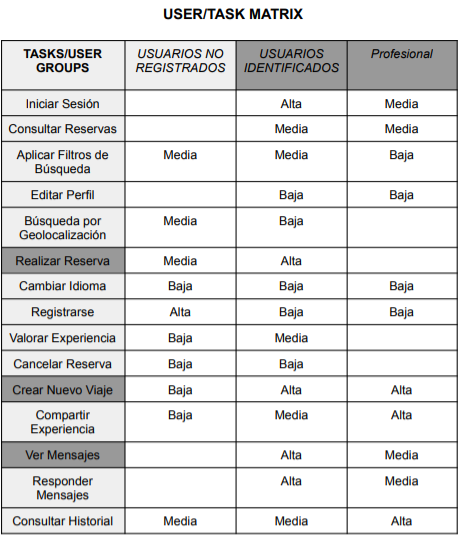
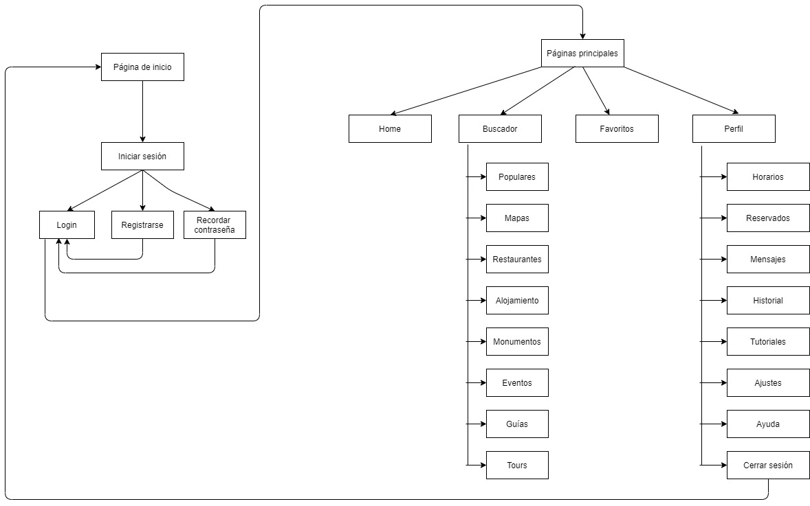
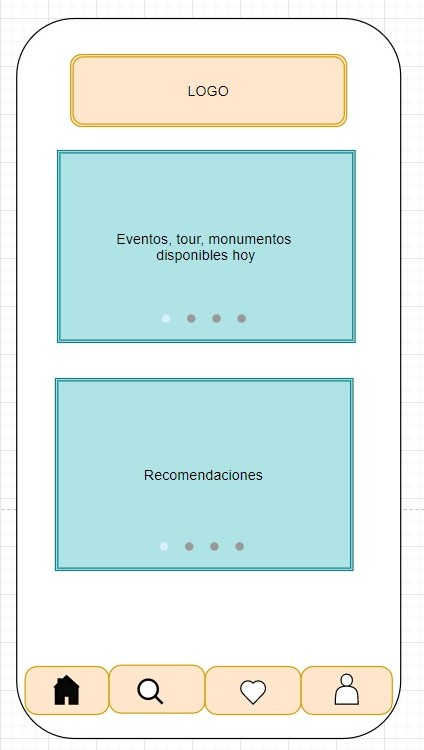
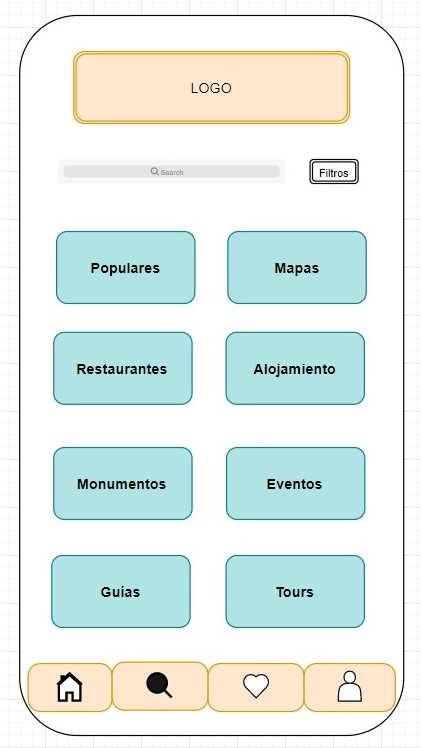
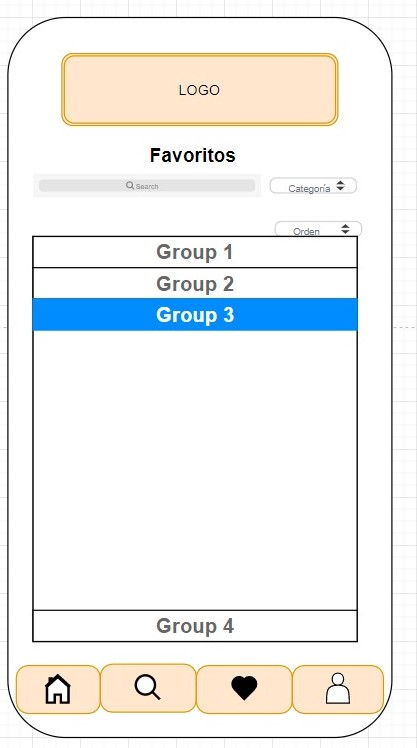
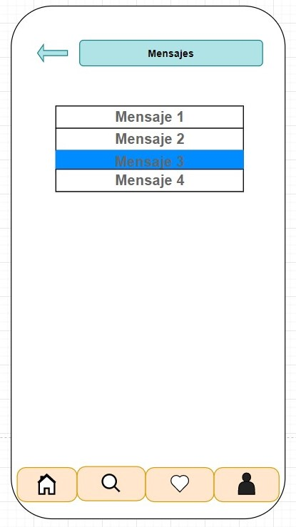
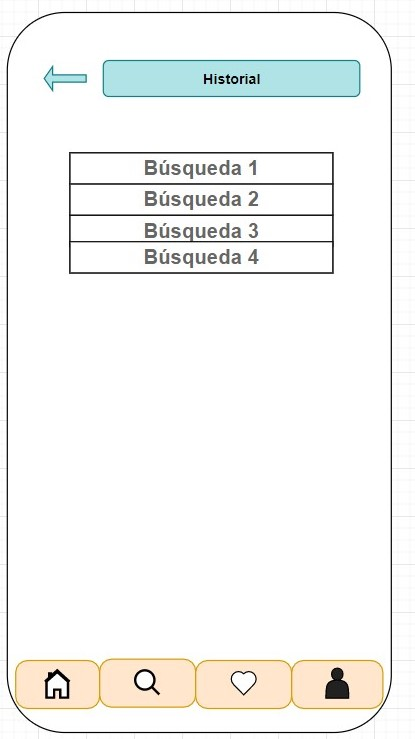
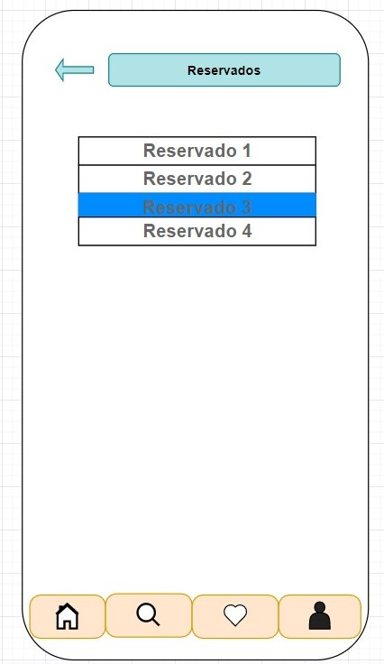

## Paso 2. UX Design  

 2.a Feedback Capture Grid / EMpathy map / POV
----

 Interesante | Críticas |     
| ------------- | ------- |
La aplicación es sencilla y fácil de utilizar | La aplicación está en varios sistemas operativos
La aplicación engloba todo lo necesario para el viaje, tanto restaurantes, como tours, como hoteles | No tiene opción de reservar directamente un alojamiento
Tiene tanto página web como aplicación móvil | No se puede iniciar sesión para guardar la información que nos interese en nuestra cuenta
Está disponible en varios idiomas | No se pueden reservar y comprar entradas de eventos directamente 
Contiene mapas | No se puede organizar todos los eventos a los que se quiere asistir en un horario

 Preguntas | Nuevas ideas |
| ------------- | ------- |
  ¿Cómo se puede reservar un alojamiento? | El alojamiento se pueda reservar directamente desde la aplicación
  ¿Cómo aprender el funcionamiento de la aplicación? | Un apartado de información en donde hay un tutorial del uso de aplicación
  ¿Cómo se puede almacenar la información de los eventos? | Un horario para poder visualizar los eventos que se han reservado cada día
  ¿Cómo se podrá saber la calidad de los eventos, restaurantes y alojamientos? | Una parte de opiniones de otros usuarios cono guía

    
 **POINT OF VIEW**
 
  Usuario | Necesidades | Explicación  
| ------------- | ------- | ----------- |
 Una persona mayor de más de 60 años que viaja a Granada | Necesita una aplicación sencilla de utilizar que le reuna todas las necesidades del viaje | El usuario va a priorizar que la aplicación sea sencilla y que contenga todo lo que va a necesitar en el viaje (alojamiento, guías, restaurantes, mapas,...) ya que le va a suponer un esfuerzo aprender cómo funcionan diferentes aplicaciones. Le gustaría que la aplicación tuviera las letras grandes y que tuviera un apartado tutorial del funcionamiento de ésta.
 Una persona desea reservar alojamiento en Granada | Necesita reservar alojamiento en la aplicación | El usuario va a desear que la aplicación le indique las mejores zonas de Granada, así como que se puedan ver todas las características y el precio del alojamiento. Le será importante también que se pueda reservar y gestionar a través de la aplicación.
Una familia que visita Granada | Necesita organizar todos los datos de su viaje a Granada | El usuario va a necesitar poder gestionar la reserva de las entradas de todos los miembros de la familia y poder ver todos los eventos a los que van a asistir organizados en un horario

 2.b ScopeCanvas
----

Nuestro proyecto consiste en una aplicación de turismo del ayuntamiento de Granada que consiga englobar toda la información y servicios necesarios por los turistas
para ofrecer una buena experiencia viajando a la ciudad. Por tanto, ofrecerá tanto el alojamiento, como audioguías, tours de la ciudad, información y reserva de eventos, curiosidades, mapas, restaurantes,... Se podrá tener un horario para organizar el viaj y se podrá añadir a favoritos información que nos interese. Por último, se podrá ver las opiniones de otras personas, y así como añadir su propia opinión.

 2.b Tasks analysis 
-----

Se ha decidido escoger el método de User/Task matrix ya que su interpretación es más sencilla y permite a primera vista distinguir que aspectos del proyecto habría que desarrollar con más detalle y también nos permite identificar qué tareas son más importantes para cada usuario.

 2.c IA: Sitemap + Labelling 
----

 2.d Wireframes
-----

