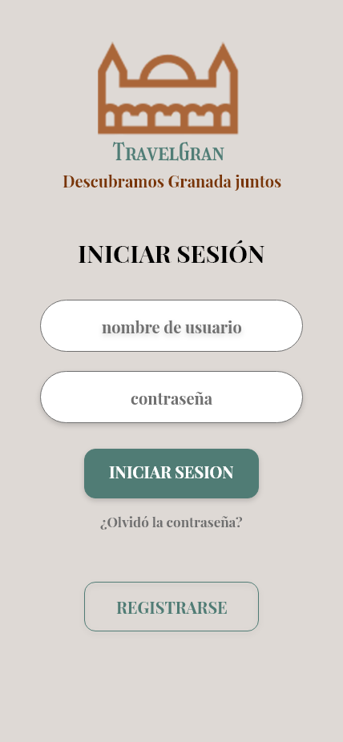
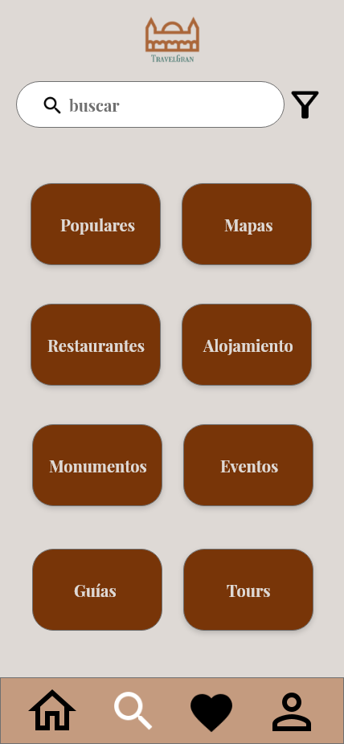

# DIU21
Prácticas Diseño Interfaces de Usuario 2020-21 (Tema: Turismo) 

Grupo: DIU2_Alhucemas  Curso: 2020/21 
Updated: 16/05/2021

Proyecto: TravelGran

Descripción: Aplicación que permita reservar y planear viajes que incluyen todo tipo de posibles actividades que se puedan realizar durante la visita, y para obtener información nos hemos basado en el análisis de la Web [TurGranada](https://www.turgranada.es/).

Logotipo:

Miembros
 * :bust_in_silhouette:   Hossam Dady     :octocat:     
 * :bust_in_silhouette:  Amanda Moyano Romero     :octocat:

----- 

## Paso 3. Mi UX-Case Study (diseño)

 3.a Moodboard
-----

Para la creación del logotipo hemos utilizado una página web llamada [freelogodesign](https://es.freelogodesign.org/) que nos proporciona varios logos a elegir a partir del nombre que le introducimos, en nuestro caso el nombre de nuestra aplicación, TravelGran.

  3.b Landing Page
----

 3.c Guidelines
----

**Guidelines**

Para la Topografía hemos elegido dos fuentes, la primera es [PlayFair Display](https://fonts.google.com/specimen/Playfair+Display?query=Play&preview.text=Turismo%20por%20Granada&preview.text_type=custom), se usará en tres variantes "Regular", "Medium" y "Semi-bold". Esta fuente será principalmente para la mayoría de los textos explicativos y descriptivos que aparecen por pantalla. La segunda fuente que se usará es [Girassol](https://fonts.google.com/specimen/Girassol?preview.text=Turismo%20por%20Granada&preview.text_type=custom#standard-styles) con una solo varieante, la "Regular". Esta fuente solo será para los títulos y subtítulos que aparecen en la página, ya que tiene un aspecto raro y distinto a las fuentes que normalmente se usan en los textos.  

En cuanto a la paleta de colores hemos elegido 5 colores, entre ellos están, el gris(#DED9D5) que se usa como color auxiliar y es compatible con los demás colores, tres tipos de marrón(#C49B7F, #AA6639, #783508) usados como color principal y además al ser de distintos tonos proporcionan dinamismo a la página, y finalmente el color verde(#507C75) que se usa como color secundario y que tiene un tono distinto al verde básico para hacerlo más atractivo a los usuarios. 

 
En cuanto a los iconos, hemos tratado de usar los que son más fáciles de interpretar a primera vista por parte de los usuarios para evitar confusiones y proporcionar un diseño con una buena representación visual.

 **Patrones IU**
 
Para determinar los elementos sobre los Patrones IU que serán usados nos hemos basado en la web [UI-Patterns](http://ui-patterns.com/), que es un sistema de diseño open-source que nos muestra una gran variedad de herramientas. Las herramientas seleccionadas son las siguientes: 

   * **Navegación Breadcrumb:** se usa para indicar la ubicación del usuario dentro del SiteMap.
   * **Frequently Asked Questions (FAQ):** su funcionalidad es informar a los usuarios mediante las preguntas más realizadas sobre la página.
   * **Autocomplete Searc:** utilizada para completar el término que el usuario desea buscar.
   * **Settings Form:** usada para que el usuario pueda configurar el funcionamiento de la aplicación.
   * **404 error pages:** para indicarle al usuario de una situación de error en la aplicación.
   * **Lazy Registration:** se le permitirá a un cliente poder usar la página sin haberse registrado anteriormente.
   * **Product Page:** se le proporcionará al usuario una página por cada evento en la que aparece información relativa a este.
   * **Shopping Cart:** es un carro de compras donde el usuario puede introducir varios eventos y podrá reservarlos todos con un solo procesamiento de pago.
   * **Pull to Refresh:** permite refrescar la página cuando se desliza la página hacia abajo. Esta funciona solo en los dispositivos móviles.
 

  3.d Mockup
----

También hemos realizado un vídeo con la simulación: [Vídeo del mockup](https://drive.google.com/file/d/1PcdUR4mJ9y-ywtGOsj0Zwa8yXB0fg_ml/view?usp=sharing)

 3.e ¿My UX-Case Study?
-----
Hemos realizado un vídeo en el que se explica todo el proceso de desarrollo y diseño de la aplicación.
[Vídeo del Case Study](https://drive.google.com/file/d/1uKdwKgjegRx6CktzkorMInaVkGZFvI-O/view?usp=sharing)

