# DIU21
Prácticas Diseño Interfaces de Usuario 2020-21 (Tema: Turismo) 

Grupo: DIU2_Alhucemas  Curso: 2020/21 
Updated: 20/04/2021

Proyecto: 
>>> Decida el nombre corto de su propuesta en la práctica 2 

Descripción: Aplicación que permita reservar y planear viajes que incluyen todo tipo de posibles actividades que se puedan realizar durante la visita.

Logotipo: 
>>> Opcionalmente si diseña un logotipo para su producto en la práctica 3 pongalo aqui

Miembros
 * :bust_in_silhouette:   Hossam Dady     :octocat:     
 * :bust_in_silhouette:  Amanda Moyano Romero     :octocat:

----- 

# Proceso de Diseño 

## Paso 1. UX Desk Research & Analisis 

 1.a Competitive Analysis
-----
Hemos elegido TurGranada, una plataforma de turismo de la diputación de Granada. Por lo que comenzamos buscando diferentes aplicaciones y páginas web que ofrecen una experiencia similar a ésta para poder hacer su análisis competitivo. Para ello, hemos elaborado la siguiente tabla:

Hemos comprobado que TurGranada es de las plataformas que más opciones ofrece junto con GranadaTur, una plataforma del ayuntamiento de Granada. Ambas ofrecen todo tipo de opciones y son gratuitas, pero GranadaTur, a diferencia de TurGranada, no dispone de una opción de iniciar sesión, pero sí dispone de audioguías. Aunque TurGranada está bien diseñada y ofrece una gran variedad de funcionalidades, le falta que implementar una de las funcionalidades más importantes que es el permitir a los usuarios hacer las reservas y pagar a través de la web, una funcionalidad que TurGranada no implementa y que la mayoría de sus competidores sí lo hacen como por ejemplo BeTogetherTours, Civitatis, etc. La falta de la implementación de esta funcionalidad le da la oportunidad a otras webs a competir con TurGranada ya que si se hubiera implementado no habría otros aspectos sobre los que otras webs competirían con TurGranada ya que en general es una página web bien diseñada.

 1.b Persona
-----

Para empezar, hemos creado a María, una mujer jubilada con muchas ganas de viajar y descubrir nuevos lugares, pero no tiene un buen entendimiento de las nuevas tecnologías. Nos pareció una persona ideal de estudiar ya que tendría el interés de utilizar una plataforma con información turística y le podría ayudar mucho, pero va a tener el gran conflicto de navegarla de forma correcta.

Posteriormente, decidimos crear a Joaquín Luque, un estudiante universitario que después de criarse en Granada, se ha mudado a Madrid. Nos resultó muy interesante que las plataformas turísticas de Granada no sólo serían usadas por turistas, sino también, por personas como Joaquín que tras irse, vuelven de visita con más ganas que nunca de disfrutar de la ciudad. A diferencia de María, Joaquín es una persona acostumbrada al uso de la tecnología.

 1.c User Journey Map
----
Para María, hemos pensado en una experiencia relacionada con su falta de conocimiento de navegar por las aplicaciones. Es un caso muy habital no encontrar alguna funcionalidad cuando uno no está acostumbrado a navegar por estas plataformas.

Para Joaquín Luque, hemos escogido esta experiencia porque es muy común no poder reunir toda la información de los alquileres y tener que llamar a cada sitio a preguntar, como el caso de nuestra aplicación que no ofrece pagos a través de la web lo que nos obliga a consultar sitio a sitio.

 1.d Usability Review
----

>>> - Enlace al documento:  
>>> - Valoración final (numérica): 77(Good)
>>> - Resumen de la valoración: Ha obtenido una valoración de 77(Good) sobre 100. Creemos que es una plataforma con la que se ofrece una experiencia adecuada. Podría mejorar sobre todo en su rendimiento, ya que a veces tarda en cargarse, y la conexión a ayuda ya que se abre en la misma ventana. La plataforma excede en tener una navegación sencilla y clara pero le falta implementar la funcionalidad que la convertiría en una página web casi perfecta, y esa funcionalidad es permitir a los usuarios realizar las reservas a través de su web y no tener que acceder a webs externas.

## Paso 2. UX Design  

 2.a Feedback Capture Grid / EMpathy map / POV
----

 Interesante | Críticas |     
| ------------- | ------- |
La aplicación es sencilla y fácil de utilizar | La aplicación está en varios sistemas operativos
La aplicación engloba todo lo necesario para el viaje, tanto restaurantes, como tours, como hoteles | No tiene opción de reservar directamente un alojamiento
Tiene tanto página web como aplicación móvil | No se puede iniciar sesión para guardar la información que nos interese en nuestra cuenta
Está disponible en varios idiomas | No se pueden reservar y comprar entradas de eventos directamente 
Contiene mapas | No se puede organizar todos los eventos a los que se quiere asistir en un horario

 Preguntas | Nuevas ideas |
| ------------- | ------- |
  ¿Cómo se puede reservar un alojamiento? | El alojamiento se pueda reservar directamente desde la aplicación
  ¿Cómo aprender el funcionamiento de la aplicación? | Un apartado de información en donde hay un tutorial del uso de aplicación
  ¿Cómo se puede almacenar la información de los eventos? | Un horario para poder visualizar los eventos que se han reservado cada día
  ¿Cómo se podrá saber la calidad de los eventos, restaurantes y alojamientos? | Una parte de opiniones de otros usuarios cono guía

    
 **POINT OF VIEW**
 
  Usuario | Necesidades | Explicación  
| ------------- | ------- | ----------- |
 Una persona mayor de más de 60 años que viaja a Granada | Necesita una aplicación sencilla de utilizar que le reuna todas las necesidades del viaje | El usuario va a priorizar que la aplicación sea sencilla y que contenga todo lo que va a necesitar en el viaje (alojamiento, guías, restaurantes, mapas,...) ya que le va a suponer un esfuerzo aprender cómo funcionan diferentes aplicaciones. Le gustaría que la aplicación tuviera las letras grandes y que tuviera un apartado tutorial del funcionamiento de ésta.
 Una persona desea reservar alojamiento en Granada | Necesita reservar alojamiento en la aplicación | El usuario va a desear que la aplicación le indique las mejores zonas de Granada, así como que se puedan ver todas las características y el precio del alojamiento. Le será importante también que se pueda reservar y gestionar a través de la aplicación.
Una familia que visita Granada | Necesita organizar todos los datos de su viaje a Granada | El usuario va a necesitar poder gestionar la reserva de las entradas de todos los miembros de la familia y poder ver todos los eventos a los que van a asistir organizados en un horario
 
 
 
>>> ¿Que planteas como "propuesta de valor" para un nuevo diseño de aplicación para economia colaborativa ?
>>> Problema e hipótesis
>>>  Que planteas como "propuesta de valor" para un nuevo diseño de aplicación para economia colaborativa te
>>> (150-200 caracteres)

 2.b ScopeCanvas
----

Nuestro proyecto consiste en una aplicación de turismo del ayuntamiento de Granada que consiga englobar toda la información y servicios necesarios por los turistas
para ofrecer una buena experiencia viajando a la ciudad. Por tanto, ofrecerá tanto el alojamiento, como audioguías, tours de la ciudad, información y reserva de eventos, curiosidades, mapas, restaurantes,... Se podrá tener un horario para organizar el viaj y se podrá añadir a favoritos información que nos interese. Por último, se podrá ver las opiniones de otras personas, y así como añadir su propia opinión.

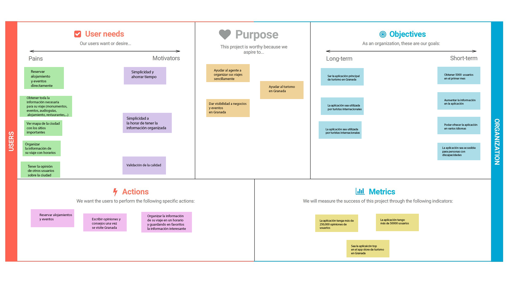

 2.b Tasks analysis 
-----

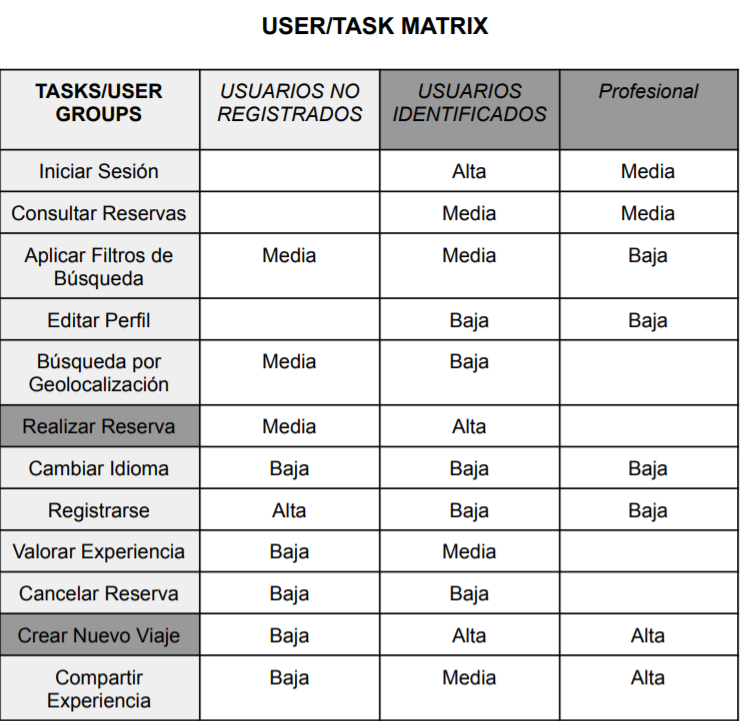

Se ha decidido escoger el método de User/Task matrix ya que su interpretación es más sencilla y permite a primera vista distinguir que aspectos del proyecto habría que desarrollar con más detalle y también nos permite identificar qué tareas son más importantes para cada usuario.

 2.c IA: Sitemap + Labelling 
----

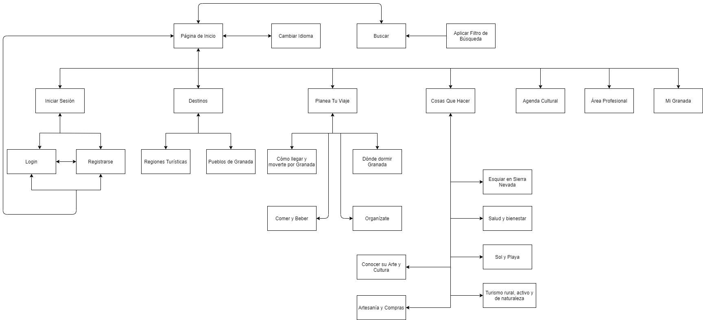

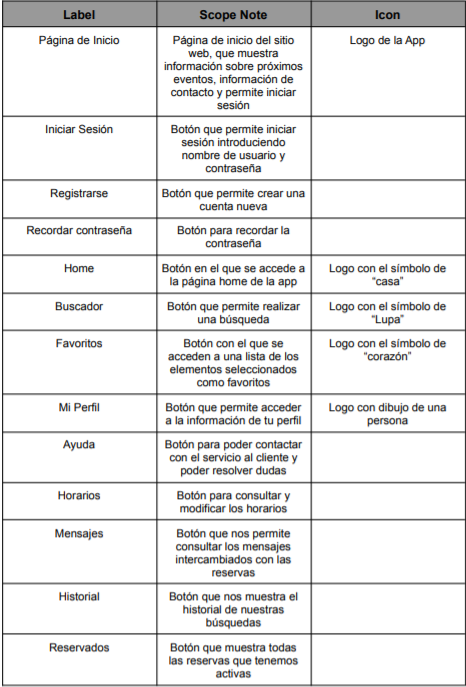

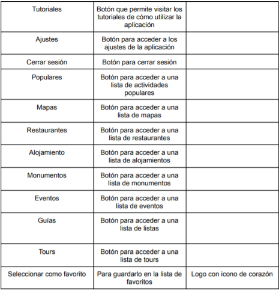

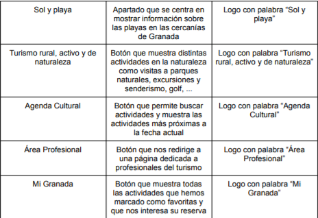

 2.d Wireframes
-----

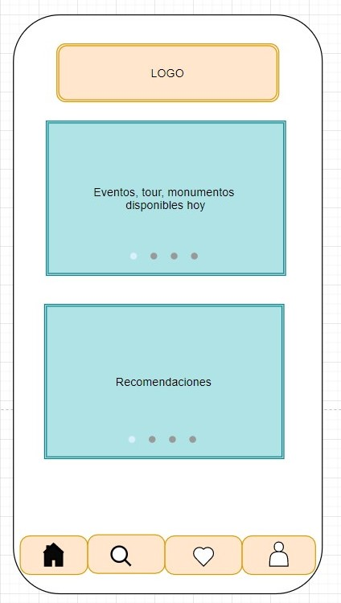

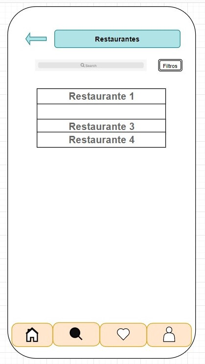
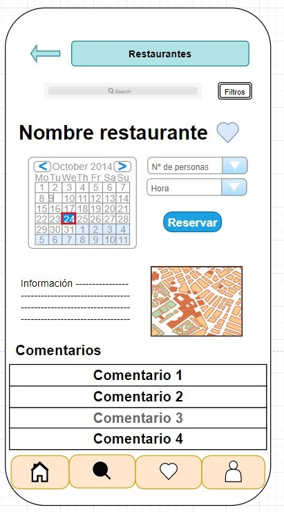
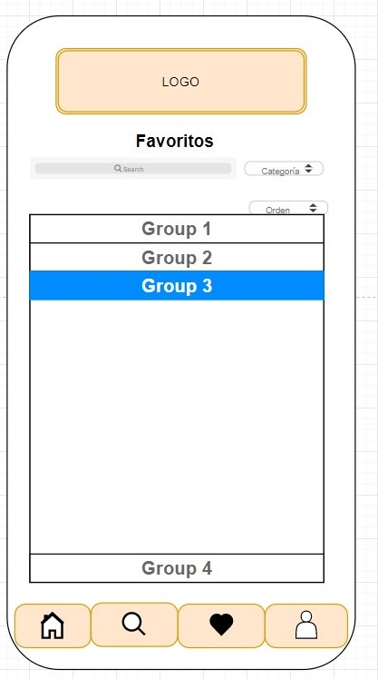
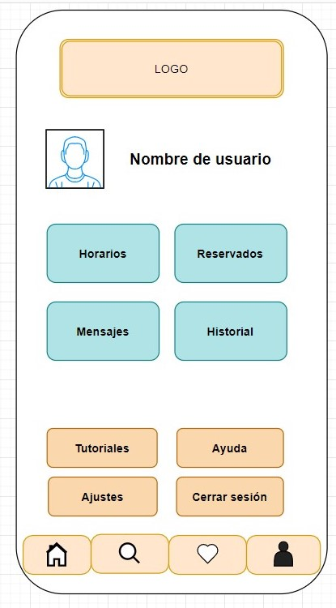
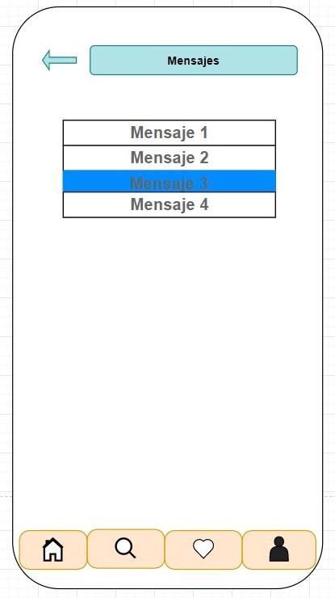
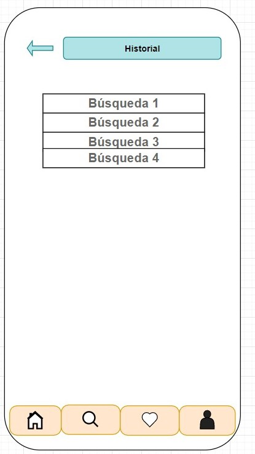
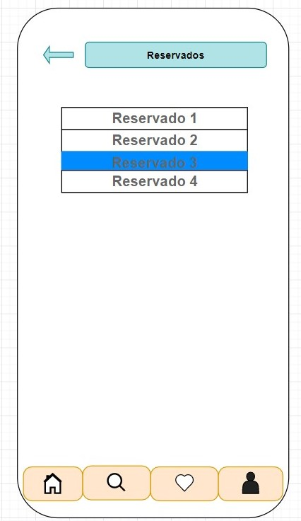

## Paso 3. Mi UX-Case Study (diseño)

 3.a Moodboard
-----

>>> Plantear Diseño visual con una guía de estilos visual (moodboard) 
>>> Incluir Logotipo
>>> Si diseña un logotipo, explique la herramienta utilizada y la resolución empleada. ¿Puede usar esta imagen como cabecera de Twitter, por ejemplo, o necesita otra?

  3.b Landing Page
----

>>> Plantear Landing Page 

 3.c Guidelines
----

>>> Estudio de Guidelines y Patrones IU a usar 
>>> Tras documentarse, muestre las deciones tomadas sobre Patrones IU a usar para la fase siguiente de prototipado. 

  3.d Mockup
----

>>> Layout: Mockup / prototipo HTML  (que permita simular tareas con estilo de IU seleccionado)

 3.e ¿My UX-Case Study?
-----

>>> Publicar my Case Study en Github..
>>> Documente y resuma el diseño de su producto en forma de video de 90 segundos aprox

## Paso 4. Evaluación 

 4.a Caso asignado
----

>>> Breve descripción del caso asignado con enlace a  su repositorio Github

 4.b User Testing
----

>>> Seleccione 4 personas ficticias. Exprese las ideas de posibles situaciones conflictivas de esa persona en las propuestas evaluadas. Asigne dos a Caso A y 2 al caso B
 

| Usuarios | Sexo/Edad     | Ocupación   |  Exp.TIC    | Personalidad | Plataforma | TestA/B
| ------------- | -------- | ----------- | ----------- | -----------  | ---------- | ----
| User1's name  | H / 18   | Estudiante  | Media       | Introvertido | Web.       | A 
| User2's name  | H / 18   | Estudiante  | Media       | Timido       | Web        | A 
| User3's name  | M / 35   | Abogado     | Baja        | Emocional    | móvil      | B 
| User4's name  | H / 18   | Estudiante  | Media       | Racional     | Web        | B 

. 4.c Cuestionario SUS
----

>>> Usaremos el **Cuestionario SUS** para valorar la satisfacción de cada usuario con el diseño (A/B) realizado. Para ello usamos la [hoja de cálculo](https://github.com/mgea/DIU19/blob/master/Cuestionario%20SUS%20DIU.xlsx) para calcular resultados sigiendo las pautas para usar la escala SUS e interpretar los resultados
http://usabilitygeek.com/how-to-use-the-system-usability-scale-sus-to-evaluate-the-usability-of-your-website/)
Para más información, consultar aquí sobre la [metodología SUS](https://cui.unige.ch/isi/icle-wiki/_media/ipm:test-suschapt.pdf)

>>> Adjuntar captura de imagen con los resultados + Valoración personal 

 4.d Usability Report
----

>> Añadir report de usabilidad para práctica B (la de los compañeros)

>>> Valoración personal 

## Paso 5. Evaluación de Accesibilidad  

  5.a Accesibility evaluation Report 
----

>>> Indica qué pretendes evaluar (de accesibilidad) sobre qué APP y qué resultados has obtenido 

>>> 5.a) Evaluación de la Accesibilidad (con simuladores o verificación de WACG) 
>>> 5.b) Uso de simuladores de accesibilidad 

>>> (uso de tabla de datos, indicar herramientas usadas) 

>>> 5.c Breve resumen del estudio de accesibilidad (de práctica 1) y puntos fuertes y de mejora de los criterios de accesibilidad de tu diseño propuesto en Práctica 4.

## Conclusión final / Valoración de las prácticas

>>> (90-150 palabras) Opinión del proceso de desarrollo de diseño siguiendo metodología UX y valoración (positiva /negativa) de los resultados obtenidos  

