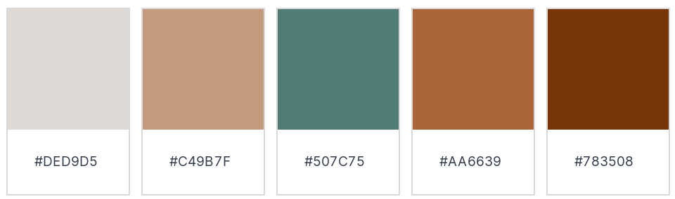
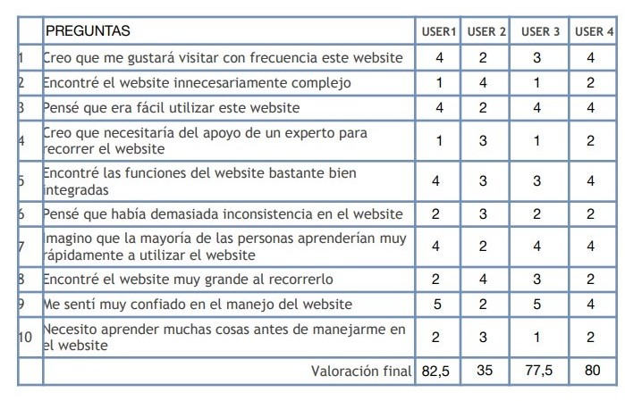

# DIU21
Prácticas Diseño Interfaces de Usuario 2020-21 (Tema: Turismo) 

Grupo: DIU2_Alhucemas  Curso: 2020/21 
Updated: 31/05/2021

Proyecto: TravelGran

Descripción: Aplicación que permita reservar y planear viajes que incluyen todo tipo de posibles actividades que se puedan realizar durante la visita, y para obtener información nos hemos basado en el análisis de la Web [TurGranada](https://www.turgranada.es/).

Logotipo:

Miembros
 * :bust_in_silhouette:   Hossam Dady     :octocat:     
 * :bust_in_silhouette:  Amanda Moyano Romero     :octocat:

----- 

# Proceso de Diseño 

## Paso 1. UX Desk Research & Analisis 

 1.a Competitive Analysis
-----
Hemos elegido TurGranada, una plataforma de turismo de la diputación de Granada. Por lo que comenzamos buscando diferentes aplicaciones y páginas web que ofrecen una experiencia similar a ésta para poder hacer su análisis competitivo. Para ello, hemos elaborado la siguiente tabla:

Hemos comprobado que TurGranada es de las plataformas que más opciones ofrece junto con GranadaTur, una plataforma del ayuntamiento de Granada. Ambas ofrecen todo tipo de opciones y son gratuitas, pero GranadaTur, a diferencia de TurGranada, no dispone de una opción de iniciar sesión, pero sí dispone de audioguías. Aunque TurGranada está bien diseñada y ofrece una gran variedad de funcionalidades, le falta que implementar una de las funcionalidades más importantes que es el permitir a los usuarios hacer las reservas y pagar a través de la web, una funcionalidad que TurGranada no implementa y que la mayoría de sus competidores sí lo hacen como por ejemplo BeTogetherTours, Civitatis, etc. La falta de la implementación de esta funcionalidad le da la oportunidad a otras webs a competir con TurGranada ya que si se hubiera implementado no habría otros aspectos sobre los que otras webs competirían con TurGranada ya que en general es una página web bien diseñada.

 1.b Persona
-----

Para empezar, hemos creado a María, una mujer jubilada con muchas ganas de viajar y descubrir nuevos lugares, pero no tiene un buen entendimiento de las nuevas tecnologías. Nos pareció una persona ideal de estudiar ya que tendría el interés de utilizar una plataforma con información turística y le podría ayudar mucho, pero va a tener el gran conflicto de navegarla de forma correcta.

Posteriormente, decidimos crear a Joaquín Luque, un estudiante universitario que después de criarse en Granada, se ha mudado a Madrid. Nos resultó muy interesante que las plataformas turísticas de Granada no sólo serían usadas por turistas, sino también, por personas como Joaquín que tras irse, vuelven de visita con más ganas que nunca de disfrutar de la ciudad. A diferencia de María, Joaquín es una persona acostumbrada al uso de la tecnología.

 1.c User Journey Map
----
Para María, hemos pensado en una experiencia relacionada con su falta de conocimiento de navegar por las aplicaciones. Es un caso muy habital no encontrar alguna funcionalidad cuando uno no está acostumbrado a navegar por estas plataformas.

Para Joaquín Luque, hemos escogido esta experiencia porque es muy común no poder reunir toda la información de los alquileres y tener que llamar a cada sitio a preguntar, como el caso de nuestra aplicación que no ofrece pagos a través de la web lo que nos obliga a consultar sitio a sitio.

 1.d Usability Review
----

>>> - Enlace al documento:  
>>> - Valoración final (numérica): 77(Good)
>>> - Resumen de la valoración: Ha obtenido una valoración de 77(Good) sobre 100. Creemos que es una plataforma con la que se ofrece una experiencia adecuada. Podría mejorar sobre todo en su rendimiento, ya que a veces tarda en cargarse, y la conexión a ayuda ya que se abre en la misma ventana. La plataforma excede en tener una navegación sencilla y clara pero le falta implementar la funcionalidad que la convertiría en una página web casi perfecta, y esa funcionalidad es permitir a los usuarios realizar las reservas a través de su web y no tener que acceder a webs externas.

## Paso 2. UX Design  

 2.a Feedback Capture Grid / EMpathy map / POV
----

 Interesante | Críticas |     
| ------------- | ------- |
La aplicación es sencilla y fácil de utilizar | La aplicación está en varios sistemas operativos
La aplicación engloba todo lo necesario para el viaje, tanto restaurantes, como tours, como hoteles | No tiene opción de reservar directamente un alojamiento
Tiene tanto página web como aplicación móvil | No se puede iniciar sesión para guardar la información que nos interese en nuestra cuenta
Está disponible en varios idiomas | No se pueden reservar y comprar entradas de eventos directamente 
Contiene mapas | No se puede organizar todos los eventos a los que se quiere asistir en un horario

 Preguntas | Nuevas ideas |
| ------------- | ------- |
  ¿Cómo se puede reservar un alojamiento? | El alojamiento se pueda reservar directamente desde la aplicación
  ¿Cómo aprender el funcionamiento de la aplicación? | Un apartado de información en donde hay un tutorial del uso de aplicación
  ¿Cómo se puede almacenar la información de los eventos? | Un horario para poder visualizar los eventos que se han reservado cada día
  ¿Cómo se podrá saber la calidad de los eventos, restaurantes y alojamientos? | Una parte de opiniones de otros usuarios cono guía

    
 **POINT OF VIEW**
 
  Usuario | Necesidades | Explicación  
| ------------- | ------- | ----------- |
 Una persona mayor de más de 60 años que viaja a Granada | Necesita una aplicación sencilla de utilizar que le reuna todas las necesidades del viaje | El usuario va a priorizar que la aplicación sea sencilla y que contenga todo lo que va a necesitar en el viaje (alojamiento, guías, restaurantes, mapas,...) ya que le va a suponer un esfuerzo aprender cómo funcionan diferentes aplicaciones. Le gustaría que la aplicación tuviera las letras grandes y que tuviera un apartado tutorial del funcionamiento de ésta.
 Una persona desea reservar alojamiento en Granada | Necesita reservar alojamiento en la aplicación | El usuario va a desear que la aplicación le indique las mejores zonas de Granada, así como que se puedan ver todas las características y el precio del alojamiento. Le será importante también que se pueda reservar y gestionar a través de la aplicación.
Una familia que visita Granada | Necesita organizar todos los datos de su viaje a Granada | El usuario va a necesitar poder gestionar la reserva de las entradas de todos los miembros de la familia y poder ver todos los eventos a los que van a asistir organizados en un horario

 2.b ScopeCanvas
----

Nuestro proyecto consiste en una aplicación de turismo del ayuntamiento de Granada que consiga englobar toda la información y servicios necesarios por los turistas
para ofrecer una buena experiencia viajando a la ciudad. Por tanto, ofrecerá tanto el alojamiento, como audioguías, tours de la ciudad, información y reserva de eventos, curiosidades, mapas, restaurantes,... Se podrá tener un horario para organizar el viaje y se podrá añadir a favoritos información que nos interese. Por último, se podrá ver las opiniones de otras personas, y así como añadir su propia opinión.

 2.b Tasks analysis 
-----

Se ha decidido escoger el método de User/Task matrix ya que su interpretación es más sencilla y permite a primera vista distinguir que aspectos del proyecto habría que desarrollar con más detalle y también nos permite identificar qué tareas son más importantes para cada usuario.

 2.c IA: Sitemap + Labelling 
----

 2.d Wireframes
-----

## Paso 3. Mi UX-Case Study (diseño)

 3.a Moodboard
-----

Para la creación del logotipo hemos utilizado una página web llamada [freelogodesign](https://es.freelogodesign.org/) que nos proporciona varios logos a elegir a partir del nombre que le introducimos, en nuestro caso el nombre de nuestra aplicación, TravelGran.

  3.b Landing Page
----

 3.c Guidelines
----

**Guidelines**

Para la Topografía hemos elegido dos fuentes, la primera es [PlayFair Display](https://fonts.google.com/specimen/Playfair+Display?query=Play&preview.text=Turismo%20por%20Granada&preview.text_type=custom), se usará en tres variantes "Regular", "Medium" y "Semi-bold". Esta fuente será principalmente para la mayoría de los textos explicativos y descriptivos que aparecen por pantalla. La segunda fuente que se usará es [Girassol](https://fonts.google.com/specimen/Girassol?preview.text=Turismo%20por%20Granada&preview.text_type=custom#standard-styles) con una solo varieante, la "Regular". Esta fuente solo será para los títulos y subtítulos que aparecen en la página, ya que tiene un aspecto raro y distinto a las fuentes que normalmente se usan en los textos.  

En cuanto a la paleta de colores hemos elegido 5 colores, entre ellos están, el gris(#DED9D5) que se usa como color auxiliar y es compatible con los demás colores, tres tipos de marrón(#C49B7F, #AA6639, #783508) usados como color principal y además al ser de distintos tonos proporcionan dinamismo a la página, y finalmente el color verde(#507C75) que se usa como color secundario y que tiene un tono distinto al verde básico para hacerlo más atractivo a los usuarios. 

 
En cuanto a los iconos, hemos tratado de usar los que son más fáciles de interpretar a primera vista por parte de los usuarios para evitar confusiones y proporcionar un diseño con una buena representación visual.

 **Patrones IU**
 
Para determinar los elementos sobre los Patrones IU que serán usados nos hemos basado en la web [UI-Patterns](http://ui-patterns.com/), que es un sistema de diseño open-source que nos muestra una gran variedad de herramientas. Las herramientas seleccionadas son las siguientes: 

   * **Navegación Breadcrumb:** se usa para indicar la ubicación del usuario dentro del SiteMap.
   * **Frequently Asked Questions (FAQ):** su funcionalidad es informar a los usuarios mediante las preguntas más realizadas sobre la página.
   * **Autocomplete Searc:** utilizada para completar el término que el usuario desea buscar.
   * **Settings Form:** usada para que el usuario pueda configurar el funcionamiento de la aplicación.
   * **404 error pages:** para indicarle al usuario de una situación de error en la aplicación.
   * **Lazy Registration:** se le permitirá a un cliente poder usar la página sin haberse registrado anteriormente.
   * **Product Page:** se le proporcionará al usuario una página por cada evento en la que aparece información relativa a este.
   * **Shopping Cart:** es un carro de compras donde el usuario puede introducir varios eventos y podrá reservarlos todos con un solo procesamiento de pago.
   * **Pull to Refresh:** permite refrescar la página cuando se desliza la página hacia abajo. Esta funciona solo en los dispositivos móviles.
 

  3.d Mockup
----

También hemos realizado un vídeo con la simulación: [Vídeo del mockup](https://drive.google.com/file/d/1PcdUR4mJ9y-ywtGOsj0Zwa8yXB0fg_ml/view?usp=sharing)

 3.e ¿My UX-Case Study?
-----
Hemos realizado un vídeo en el que se explica todo el proceso de desarrollo y diseño de la aplicación.
[Vídeo del Case Study](https://drive.google.com/file/d/1uKdwKgjegRx6CktzkorMInaVkGZFvI-O/view?usp=sharing)

## Paso 4. Evaluación 

 4.a Caso asignado
----
Vamos a evaluar al grupo TeamAlpacas de DIU1 con su aplicación [Appestruz](https://github.com/susolr/DIU21) que se trata de una aplicación que permite planificar y gestionar viajes ofreciendo a los usuarios una gran variedad de eventos que disfrutar y la opción de poder realizar todas las reservas deseadas, a través de la aplicación.

 

 4.b User Testing
----

Para obtener valoraciones sobre nuestros dos casos hemos elegido 4 personas, que incluyen tanto a personas ficticias como reales. Hemos intentado elegir a usuarios con distintas perspectivas y experiencias para que se pueda proporcionar una valoración más detallada según las necesidades de las distintas personas. 

| Usuarios |    Sexo/Edad  |      Ocupación      |  Exp.TIC    | Personalidad  | Plataforma | TestA/B
| ---------| ------------- | ------------------- | ----------- | ------------- | ---------- | --------
| María    | M / 31        | Médico              | Media       | Perfecionista | Móvil      | A 
| Juan     | H / 21        | Estudiante          | Alta        | Extrovertido  | Móvil      | A        
| Pablo    | H / 63        | Jubilado            | Baja        | Estusiasmado  | Web        | B 
| Carmen   | M / 28        | Profesora de Inglés | Alta        | Enérgica      | Móvil      | B 

. 4.c Cuestionario SUS
----

**Cuestionario CASO A (TravelGran)**

**Cuestionario CASO B (Appestruz)**

**Test A/B**

Como podemos observar tanto en los cuestionarios SUS de ambos casos como el Test A/B hay una gran diferencia entre la valoración que aporta el User2(Pablo) y los demás usuarios y eso se debe a la diferencia de experiencia en el mundo del internet entre el User2(Pablo) y los demás usuarios, que como observamos, tiene menos experiencia en internet por lo que la mayoría de las funcionalidades que por ejemplo al User3(Juan) le parecen báscias y sencillas, al User2(Pablo) le parecen más complicadas y necesitaría tiempo para acostumbrarse. Esto demuestra que para ambos casos se podría mejorar el sistema de instrucciones en caso de que el usuario las necesite, para que su utilización se considere cómoda por parte de los usuarios.

 4.d Usability Report
----

>>> Añadir report de usabilidad para práctica B (la de los compañeros) → [Usability Review](P1/Usability-review-template.pdf)

>>> Valoración personal: 

Como conclusión final podemos decir que la aplicación que han desarrollado nuestros compañeros nos ha llamado mucho la atención, por la selección de colores y por el diseño del Landing Page. Otro aspecto en el que nos hemos fijado fue la accesibilidad, en la que se utiliza muchas imágenes en vez de texto para definir opciones como por ejemplo a la hora de elegir el tipo de transporte o las noticias, lo cual hace que si una persona tiene alguna discapacidad relacionada con problemas visuales , a lo mejor tendrá problemas reconociendo las imágenes. Pero en general cumple con todo lo necesarios para considerarse una buena aplicación.
 
